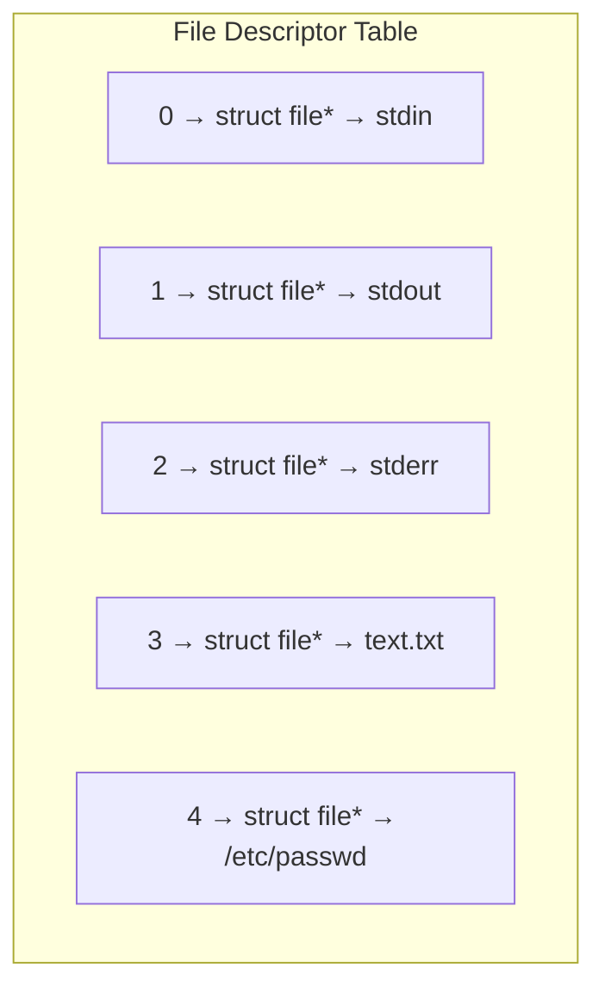

# POSIX — понятия на примере текстового файла

## 1. Что такое POSIX

**POSIX (Portable Operating System Interface)** — это семейство стандартов, определяющих:
- интерфейс между **приложением** и **операционной системой**;
- поведение системных вызовов (API), оболочки (shell) и утилит.

Главная цель POSIX:
- обеспечить **переносимость программ** между различными Unix‑подобными системами (Linux, BSD, macOS и др.);
- задать единые правила работы с процессами, файлами, правами доступа и т.п.

Важно: POSIX — это **не сама ОС**, а **набор требований и спецификаций**, как ОС должна себя вести и какие интерфейсы предоставлять.
## 2.   **Структура стандарта POSIX (IEEE 1003 / The Single UNIX Specification)**

# **1. Base Definitions — XBD**

**(Базовые определения и фундамент стандарта)**
Этот том задаёт языковую основу POSIX и общие правила для всех остальных частей.
### **Что включает:**
	
- **Терминологию**, определения всех ключевых понятий: процесс, файл, ссылка, сокет, путь, поток, пользователь, сигнал и т.п.
- **Правила синтаксиса** (например, как трактовать escape-последовательности, кавычки, спецсимволы).
- **Общие структуры данных** и соглашения:
    - стандартизированные **типы данных** (size_t, pid_t, mode_t, off_t…)
    - **структуры errno и ошибок**
    - общие правила для макросов, кодов возврата
- **Требования к структуре файловой системы POSIX**:
    что такое каталог, что такое путь, правила обхода, поведение “.” и “..”, разрешения.
- **Описание локалей (LC_*)**: правила сортировки, сравнения строк, форматы дат, чисел, классы символов.
- **Переменные окружения** (PATH, IFS, HOME, LANG и др.)
- **Все обязательные заголовочные файлы** (<unistd.h>, <stdio.h>, <sys/stat.h> и десятки других).
### **Назначение тома XBD**
Он — **словарь POSIX**.
Все остальные части отсылают к определениям из XBD, чтобы избежать неоднозначностей.
# **2. System Interfaces — XSH**
**(Системные интерфейсы — POSIX C API / расширение libc)**
Это **самая большая** часть стандарта.
Именно здесь описаны **все системные вызовы и функции стандартизованной C-библиотеки**.
### **Что входит:**
### **Файловые операции**
open, read, write, close, fsync, link, unlink, rename, stat, mkdir, opendir
Подробнее про syscalls для гиков: 
## **open(path, flags, mode)**
Открывает файл → возвращает _file descriptor_ (int).
**Внутри ОС:**
- проверка прав через VFS;
- поиск inode;
- создание записи в таблице открытых файлов процесса;
- установка смещения (file offset).
**Важно:**
- O_CREAT, O_TRUNC, O_APPEND, O_NONBLOCK;
- open — дорогой syscall.
## **read(fd, buf, count)**
Читает из файла в буфер.
**Внутри ОС:**
- проверка дескриптора;
- чтение через page cache (**кеширование блочных устройств!**);
- возможен блокирующий вызов.
## **write(fd, buf, count)**
Пишет данные.
**Внутри ОС:**
- копирует данные из user-space → kernel-space;
- кладёт в page cache;
- _не гарантирует_ запись на диск.
## **fsync(fd)** 
это системный вызов, который **принудительно сбрасывает все модифицированные данные и метаданные файла на физический диск**.
- Все данные, которые лежат в page cache (буферах ядра), **записываются на устройство хранения**.
- Метаданные файла (например, размер, timestamps) тоже сбрасываются.
- Вызов **блокирует процесс**, пока диск не подтвердит, что запись выполнена (или не произошла ошибка).
## **link(old, new)**
Создаёт **жёсткую ссылку** на inode.
## **unlink(path)**
Удаляет запись каталога.
Файл удалится физически, когда **inode refcount == 0 и файл не занят каким-то процессом, (т. е. пока живет процесс, живут и файлы, которые он пооткрывал)**.
## **rename(old, new)**
Атомарное перемещение в пределах одного файлового тома.
## **stat / lstat(path)**
Возвращает метаданные inode: размер, права, тип, nlink, время.
## **mkdir(path, mode)**
Создаёт каталог → новый inode + записи “.” и “..”.
## **opendir / readdir / closedir**
Работа с каталогами через DIR.
### Процессы
fork, execve, wait, _exit, getpid, getppid, setuid, setsid.

Опять же для гиков, но полезно всем: 
## **fork()**
Создаёт новый процесс.
**ОС:**
- копирует (лениво) page tables — **copy-on-write**;
- копирует дескрипторы;
- дочерний получает return 0, родитель — pid.
## **execve(path, argv, envp)**
Заменяет образ процесса новым.
**ОС:**
- освобождает старый address space;
- загружает ELF;
- настраивает stack (argv/env);
- начинает выполнение с entry point.
## **wait() / waitpid()**
Ждёт завершения ребёнка → получает статус.
## **_exit(status)**
Выход из процесса (без flush stdio).
## **getpid(), getppid()**
Возвращает PID процесса и родителя.
## **setuid(), setsid()**
Меняют пользователя, создают новую сессию.
### **IPC и сигналы**
signal, sigaction, kill, raise,
каналы (pipe), очереди сообщений, семафоры, shared memory.

## **signal(signo, handler)**
Устаревший способ поставить обработчик.
## **sigaction(signo, struct sigaction)**
Современный — надёжная установка сигналов.
## **kill(pid, sig)**
Посылает сигнал _процессу или группе_.
Фактически — отправка сообщения в таблицу процессов ядра.
## **raise(sig)**
Посылает сигнал _самому себе_.
## **pipe(int fd[2])**
— это системный вызов , который создаёт **односторонний канал** для передачи данных между процессами.  
Канал реализован как буфер в ядре и два файловых дескриптора:
`[0] — конец для чтения (read end) [1] — конец для записи (write end)`
#  **Сигнатура**
В C:
`int pipe(int pipefd[2]);`
После вызова:
- `pipefd[0]` — дескриптор для чтения
- `pipefd[1]` — дескриптор для записи
Возвращает `0` при успехе, `-1` при ошибке.
#  **Как это работает внутри**
`pipe()` создаёт в ядре объект типа **pipe_inode_info**:
- это кольцевой буфер (обычно 64 KB по умолчанию),
- с указателями на начало и конец,
- со списком процессов, ожидающих чтение/запись.
Оба дескриптора ссылаются на _один и тот же_ буфер.
Потом дальше всё управляется стандартными вызовами `read()` и `write()`.
###  Потоки
pthread_create, pthread_join, pthread_mutex_lock, pthread_cond_wait и др.
## **pthread_create()**
Создаёт поток → вызывает clone()/rfork() внутри ядра.
## **pthread_join()**
Ожидание завершения потока.
## **pthread_mutex_lock / unlock**
Мьютексы → реализуются через futex(). (**futex — это примитив, позволяющий реализовать мьютексы в user space и уходить в ядро только когда действительно нужно.**)
Раньше (до 2003) мьютексы в Linux работали через всегда-системные вызовы:  
`lock → ядро → switch → block → wake → ядро → обратно`. Это дорого.
Futexы позволяют:
- не вызывать ядро, если замок свободен;
- не делать переключения контекстов, если нет блокировки;
- работать на уровнях скорости atomic operations.
## **pthread_cond_wait / signal**
Условия → sleep/wakeup + mutex.
### **Сеть**
sock​et, bind, listen, accept, send, recv, getaddrinfo.
## **socket(domain, type, protocol)**
Создаёт сетевой сокет → fd.
## **bind(fd, addr)**
Привязывает сокет к адресу.
## **listen(fd, backlog)**
Переводит сокет в пассивный режим (сервер).
## **accept(fd)**
Принимает новое соединение → создаёт _новый fd_.
## **send / recv**
Отправка/приём данных.
## **getaddrinfo(host, service, hints)**
DNS + построение sockaddr структур.

Главный удобный вызов высокого уровня.
### **Таймеры, часы, планировщики**
clock_gettime, nanosleep, timer_create, sched_yield.
## **clock_gettime(clockid, timespec)**
Получение точного времени (монотонного/реального).
## **nanosleep(timespec)**
Спит заданное время → планировщик снимает поток с CPU.
## **timer_create / timer_settime**
POSIX-таймеры → при срабатывании могут отправлять сигнал.
## **sched_yield()**
Отдать квант времени → добровольный переключатель.
### **Разное**
mmap, mlock, ftruncate, dup, fcntl, setrlimit.

# **3. Shell and Utilities — XCU**

**(POSIX Shell и стандартные утилиты)**
Описывает **поведение POSIX-совместимой оболочки (sh)** и **стандартных утилит командной строки**.
### **Shell**
- правила разбора команд (parsing),
- подстановки (substitution): командная, параметров, переменных окружения,
- редиректы, пайпы,
- job control (fg, bg),
- функции shell, builtin-команды,
- правила выполнения команд и скриптов.
### **Утилиты**
POSIX описывает поведение ~150 утилит:
- ls, cp, mv, rm, chmod, grep, sed, awk, find, xargs
- printf, test, cut, sort, uniq, diff, tar, make
- vi, ed, tr, dd, head, tail, wc
Для каждой утилиты стандарт задаёт:
- синтаксис,
- поведение при ошибках,
- коды возврата,
- формат вывода,
- обязательные опции.
### **Назначение тома XCU**
Это гарантирует **переносимость shell-скриптов** между Unix-like системами.
### **Назначение тома XSH**
Это **официальный API**, гарантированный POSIX.
Если программа использует только XSH-функции → она переносима между Unix-like системами.
# **4. Rationale — XRAT**

**(Аргументация, обоснования и комментарии)**
Этот том не является обязательной частью спецификации.
Он объясняет **почему** такие решения были приняты.
### **Что внутри:**
- Исторические причины (AT&T Unix, BSD, System V).
- Почему удалили/оставили некоторые функции.
- Подводные камни и неоднозначные моменты.
- Пояснения стандартам утилит и shell.
- Комментарии по спорным аспектам API (например, вокруг signal, fork, printf и др.)
### **Назначение XRAT**
Это **комментарии к стандарту**, которые:
- не являются обязательными,
- не дают юридических требований,
- служат для разработчиков ОС, libc и экспертов.
## Основные версии POSIX
- **POSIX.1-1988** - описывал основные системные вызовы, библиотечные функции, примитивы работы с потоками ввода/вывода + минимальный набор утилит командной строки
- **POSIX.2-1992** - описывал язык команд (shell), добавление утилит по типу `grep`, `find`, `awk`
- **POSIX.1-2001 (Single UNIX Specification Version 3)** - консолидировал и модернизировал предыдущие стандарты, интегрировал все в единый стандарт.
    - Объединение POSIX.1, POSIX.2, и других расширений.
    - Поддержка современных системных вызовов.
    - Улучшенная совместимость с современными UNIX-подобными системами.
- **POSIX.1-2008 (POSIX.1-2008 или Single UNIX Specification Version 4)** - последняя* основная ****версия POSIX.
    - Поддержка многопоточности, включая обновления API pthreads.
    - Расширенные возможности командной оболочки и утилит.
    - Добавлены современные инструменты и функции, такие как `fdatasync`.
    - Ориентация на работу с большими объемами данных и многозадачность.

> 🤓☝️ Вообще-то POSIX.1-2008 не последняя основная версия. Ставлю F😱😂🤪.
> > Да, фактически все верно, но есть один моментик из [man standards](https://man7.org/linux/man-pages/man7/standards.7.html):
> ```
> POSIX.1-2017
>               This revision of POSIX is technically identical to
>               POSIX.1-2008 with Technical Corrigenda 1 and 2 applied.
> ```
> **Technical Corrigenda** — это официальные обновления к стандарту, которые выпускаются для исправления ошибок, уточнения требований или устранения двусмысленностей в тексте стандарта. Они не вводят новых функций или изменений в спецификации, а служат для улучшения интерпретации и точности документа.

<aside> ❗

С 2024 думаю будет похожая ситуация. Главное, что он вышел. Расскажите про 2008, 2017 и потом упомяните про 2024)

</aside>
- **POSIX.1-2024** - (в man нет, но официально уже выпущен)
    Пока непонятно, насколько его изменения сильны и является ли это просто продолжением ситуации с **TC** как в **POSIX.1-2017**
## 3. Файл в POSIX: обобщённое понятие

В POSIX почти всё трактуется как **файл**:
- обычные файлы (например, `text.txt`);
- каталоги;
- устройства (`/dev/sda`, `/dev/tty`);
- каналы (pipe), сокеты и т.п.
**Обычный текстовый файл** — это файл, в котором хранятся байты данных, обычно интерпретируемые как символы текста (UTF‑8, ASCII и др.).
### Главное разделение понятий

В POSIX важно различать:
1. **Имя файла (путь)** — строка, например:  
   - `text.txt`  
   - `./docs/text.txt`  
   - `/home/user/text.txt`
2. **Сам объект файла** — структура данных в файловой системе (inode), содержащая:
   - указатели на блоки данных на диске;
   - метаданные (владелец, права, время создания, размер и т.д.).

**Вывод:** имя — это только **ссылка** на файл (каталожная запись), а реальный файл — это **объект в файловой системе**.
# Текстовый файл: 

**TLDR:** Текстовый файл - файл, содержащий последовательность (возможно пустую) строк.

> _Файл, содержащий символы, организованные в пустые или нет строки. Строки не содержат знаков NULL и ни одна из них не может превышать {LINE_MAX} байт в длину, включая символ . Хотя POSIX.1-2017 не проводит различия между текстовыми и бинарными файлами (см стандарт ISO C), многие утилиты производят только предсказуемый или значимый вывод при работе с текстовыми файлами. Стандартные утилиты, которые имеют такие ограничения всегда указывают "текстовые файлы" в своих разделах STDIN или INPUT FILES._

**Строка** – последовательность символов конкретной кодировки ограниченной длин, при этом среди этой строки нет символа перевода строки, кроме последнего. (для того, чтобы при последовательном выводе содержимое разных файлов не склеивалось)

**С пары:**
- Данные должны быть человек-читаемыми
- Не двоичный код CPU
- Портируем между ОС
- Содержит закодированный в кодировке текст + управляющие последовательности

---

## 3. Путь (path) и каталоги

### 3.1. Типы путей

- **Абсолютный путь** начинается с корня `/`  
  Пример: `/home/user/documents/text.txt`
- **Относительный путь** задаётся относительно текущего каталога процесса  
  Пример: `./text.txt`, `../docs/text.txt`

POSIX определяет:
- специальный каталог `.` — текущий;
- `..` — родительский.

### 3.2. Каталог как файл

Каталог в POSIX — это **особый тип файла**, который содержит:
- список записей: имя → номер inode объекта (файла/каталога).

Например, в каталоге `/home/user` может быть запись:
- `text.txt → inode #12345

Каталог — это **структура данных файловой системы**,  
хранящая _имена и номера inode_, и она представлена в виде файла  
с типом `directory`.
А еще с каталогом можно взаимодействовать только через специальные сис вызовы: readdir,opendir, closedir, но нельзя через open(), read() и др.

---

## 4. Inode: внутренняя сущность файла

**Inode** (индексный дескриптор) — структура, описывающая файл **без привязки к имени**.

В inode хранится:
- тип объекта (обычный файл, каталог, символьное/жёсткое устройство и т.д.);
- владелец (UID), группа (GID);
- права доступа;
- размер файла (в байтах);
- времена: доступа (atime), изменения содержимого (mtime), изменения метаданных (ctime);
- ссылки на блоки данных на диске;
- количество жёстких ссылок (hard links) на этот файл.

**Важно:** один и тот же inode может иметь **несколько имён** (жёсткие ссылки).

---

## 5. Файловые дескрипторы (file descriptor)

Когда процесс хочет работать с текстовым файлом, он:
1. Указывает **имя файла** (путь).
2. ОС находит соответствующий **inode**.
3. ОС создаёт в таблице открытых файлов процесса запись и возвращает **целое число** — **файловый дескриптор** (FD).

Файловый дескриптор — это **малое целое число**, идентификатор открытого файла внутри процесса.

Стандартные дескрипторы:
- `0` — стандартный ввод (stdin);
- `1` — стандартный вывод (stdout);
- `2` — стандартный поток ошибок (stderr).

При открытии текстового файла, например `text.txt`, программа может получить дескриптор `3`, `4` и т.д.

В POSIX у процесса есть **таблица открытых файлов (File Descriptor Table)** — это обычный **массив указателей**, где индекс = файловый дескриптор (FD), а значение = указатель на структуру ядра, описывающую открытый файл.
#   Таблица открытых файлов процесса (File Descriptor Table)

Это **часть пространства процесса** (user-space data structure), которую ядро заполняет при `open()`.

- FD = индекс (0, 1, 2, 3…)
- Значение = **указатель на структуру `file` в ядре**.

## 6. Основные системные вызовы POSIX для работы с текстовым файлом

Рассмотрим классический набор вызовов POSIX на примере файла `text.txt`.

### 6.1. open()

```c
int fd = open("text.txt", O_RDONLY);
```

- Открывает файл по имени.
- Возвращает **файловый дескриптор** (fd) или `-1` при ошибке.
- Флаги:
  - `O_RDONLY` — только чтение;
  - `O_WRONLY` — только запись;
  - `O_RDWR` — чтение и запись;
  - `O_CREAT` — создать файл, если не существует (вместе с правами доступа);
  - `O_TRUNC` — обнулить файл при открытии на запись и др.

При успешном `open()` для `text.txt`:
- ОС создаёт запись в таблице открытых файлов процесса:
  - указывает inode файла;
  - устанавливает **текущую позицию** (смещение) в 0;
  - хранит режим доступа (чтение/запись).

### 6.2. read()

```c
ssize_t n = read(fd, buffer, size);
```

- Читает до `size` байт из файла, связанного с дескриптором `fd`, в `buffer`.
- Возвращает количество реально прочитанных байт или `0` при достижении конца файла.

Особенности:
- Чтение происходит **по текущей позиции (offset)**.
- После чтения offset **сдвигается** на количество прочитанных байт.
- Например, для текстового файла: читаем строку, потом следующую и т.д.

### 6.3. write()

```c
ssize_t n = write(fd, buffer, size);
```

- Записывает `size` байт из `buffer` в файл, связанный с `fd`.
- Возвращает количество реально записанных байт.
- Так же изменяет **позицию** в файле.

Если открыть `text.txt` с `O_WRONLY` и вызвать `write()`, новые данные попадут в файл (в зависимости от режима — поверх существующих или в конец).

### 6.4. lseek()

```c
off_t pos = lseek(fd, offset, whence);
```

- Изменяет **текущее смещение** (позицию) в файле.
- `whence`:
  - `SEEK_SET` — от начала файла;
  - `SEEK_CUR` — от текущей позиции;
  - `SEEK_END` — от конца файла.

Например, можно:
- перескочить к середине текстового файла;
- установить позицию в конец и дозаписать данные.

### 6.5. close()

```c
close(fd);
```

- Закрывает файл:
  - дескриптор становится недействительным;
  - запись в таблице открытых файлов процесса удаляется;
  - если больше нет процессов, использующих этот файл, ОС может освободить ресурсы.

---

## 7. Права доступа к файлу (разрешения)

POSIX определяет модель прав доступа:
- у каждого файла есть:
  - **владелец** (user, UID);
  - **группа** (group, GID);
  - права для:
    - пользователя (u),
    - группы (g),
    - остальных (o).

Права:
- `r` — read (чтение);
- `w` — write (запись);
- `x` — execute (исполнение).

Для текстового файла `text.txt` обычно:
- `-rw-r--r--`
  - владелец может читать и писать;
  - группа и остальные — только читать.

При вызове `open()` ОС проверяет:
- кто является владельцем процесса (UID, GID);
- какие права есть у файла;
- можно ли открыть на чтение/запись.

---

## 8. Метаданные файла: stat()

Системный вызов:

```c
struct stat st;
int res = stat("text.txt", &st);
```

Позволяет получить:
- режим (тип файла и права);
- размер (st_size) — количество байт в файле;
- UID, GID;
- количество жёстких ссылок;
- времена atime, mtime, ctime.

Для текстового файла `text.txt` это:
- размер в байтах (например, 1024);
- тип: обычный файл;
- права: `rw-r--r--` и т.д.

---

## 9. Связь между процессом и файлом

В POSIX есть несколько уровней:

1. **Имя файла** в каталоге → inode файла.
2. **Inode файла** → объект в файловой системе (данные + метаданные).
3. **Таблица открытых файлов ядра**:
   - хранит для каждого открытого файла:
     - указатель на inode;
     - текущую позицию (offset);
     - режим (чтение/запись);
     - флаги.
4. **Таблица дескрипторов процесса**:
   - сопоставляет **целые числа** (0, 1, 2, 3, …) с записями в таблице открытых файлов.

Когда процесс читает `text.txt`:
- он использует **номер дескриптора** (например, 3);
- ядро по дескриптору находит запись в таблице открытых файлов;
- получает inode и позицию;
- читает нужные данные.

---

## 10. Потоки, буферизация и «текстовый» характер файла

На уровне POSIX текстовый файл — это просто **последовательность байтов**.  
Понятие «строка» (заканчивающаяся `\n`) — это **условность на уровне библиотеки** (например, `stdio` в C).

Часто поверх системных вызовов POSIX используются буферизованные потоки:
- `fopen()`, `fread()`, `fgets()`, `fprintf()` и др.
- Они внутренне используют `open()`, `read()`, `write()`, `close()`, но:
  - добавляют буферы;
  - работают с понятием строк;
  - могут по-разному трактовать конец строки (особенно в разных ОС).

---

## 11. Удаление файла: unlink()

```c
unlink("text.txt");
```

В POSIX `unlink()`:
- удаляет **имя** из каталога;
- уменьшает счётчик жёстких ссылок inode;
- если счётчик стал 0 **и** нет открытых дескрипторов на этот файл:
  - данные и inode могут быть реально освобождены.

Особенность:
- если процесс всё ещё держит открытый файл `text.txt` (есть дескриптор), он может продолжать читать/писать, даже если имя в каталоге уже удалено.

---

## 12. Жёсткие и символьные ссылки

POSIX позволяет иметь несколько имён для одного файла.

### 12.1. Жёсткая ссылка (hard link)

```bash
ln text.txt copy.txt
```

- `text.txt` и `copy.txt` → это **два имени одного и того же inode**.
- У текстового файла будет увеличен счётчик ссылок.
- При изменении файла через одно имя, изменения видны через другое.

### 12.2. Символьная (symbolic) ссылка

```bash
ln -s text.txt link.txt
```

- `link.txt` содержит **путь** к другому файлу.
- Это отдельный файл особого типа (symlink).
- Если удалить `text.txt`, символическая ссылка может стать «сломленной».

---

## 13. Ошибки и errno

При работе с системными вызовами POSIX (open, read, write и др.) возможны ошибки:
- возвращаемое значение обычно `-1`;
- глобальная переменная `errno` хранит код ошибки.

Типичные ошибки при работе с текстовым файлом:
- `ENOENT` — файл не существует (`open("text.txt", ...)`);
- `EACCES` — нет прав доступа;
- `EBADF` — неверный дескриптор файла (например, `read()` после `close()`).

---

## 14. Краткий итог (конспект для запоминания)

1. **POSIX** — стандарт интерфейса ОС, определяет системные вызовы и поведение работы с файлами, процессами и т.д.
2. **Файл в POSIX**:
   - разделяются имя (путь) и объект (inode);
   - текстовый файл — последовательность байтов, обычно интерпретируемых как символы.
3. **Каталог** — особый файл, содержащий соответствие «имя → inode».
4. **Inode** хранит:
   - тип файла, права, владельца;
   - размеры, времена;
   - ссылки на блоки данных;
   - количество жёстких ссылок.
5. **Файловый дескриптор** — целое число, идентификатор открытого файла внутри процесса.
6. Основные системные вызовы POSIX для работы с текстовым файлом:
   - `open()` — открыть файл (получить дескриптор);
   - `read()` — читать данные;
   - `write()` — записывать данные;
   - `lseek()` — менять позицию в файле;
   - `close()` — закрыть файл;
   - `stat()` — получить метаданные;
   - `unlink()` — удалить имя файла.
7. **Права доступа**: три набора (user, group, others) и три бита (r, w, x).
8. Связь между процессом и файлом реализована через:
   - таблицу дескрипторов процесса и таблицу открытых файлов в ядре.
9. Удаление файла в POSIX:
   - сначала удаляется имя (unlink);
   - данные удаляются только когда нет имён и открытых дескрипторов.
10. Жёсткие и символьные ссылки позволяют иметь несколько имён для файла или ссылаться по пути.

Этот конспект можно использовать как готовый ответ на экзаменационный билет по теме  
**«POSIX: понятия на примере текстового файла»**.


От Данилы:
Что спросил Смирнов: на какие две главные группы можно разделить то что описано POSIX`ом? 
Я ответил среду сборки и исполнения после чего он поставил D и сказал - SHELL и POSIX LIB C
